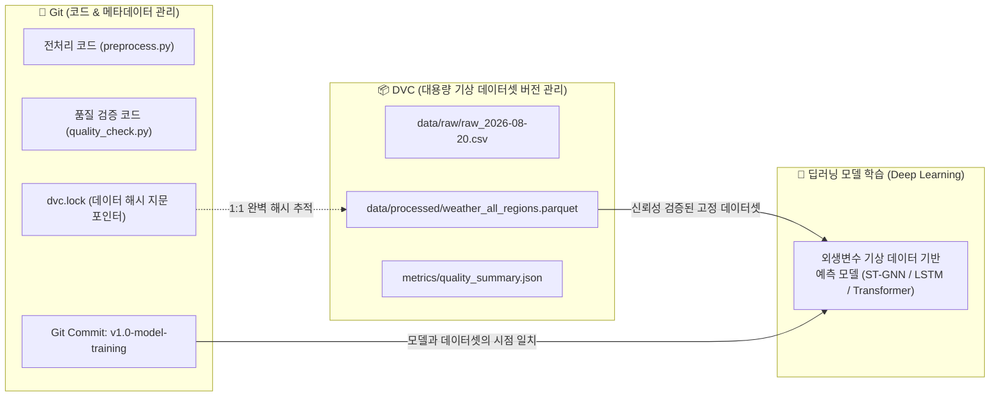
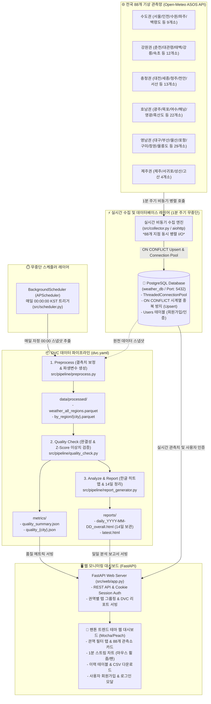
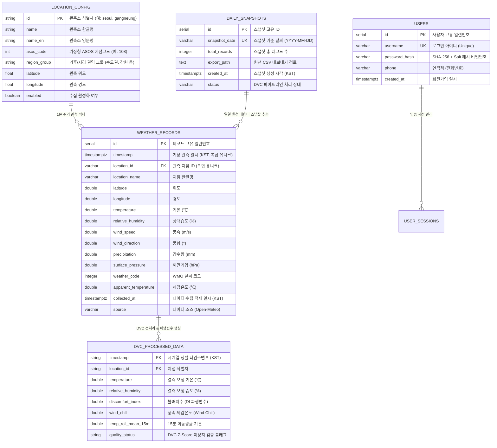
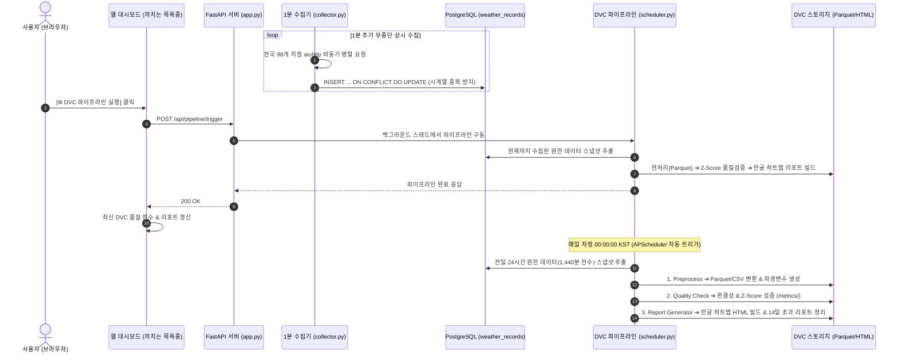

# 🐦🛁 까치는 목욕중: 전국 ASOS 실시간 기상 데이터 파이프라인 & DVC 버전 관리 시스템

> **전국 88개 기상청 ASOS 및 주요 시·군 관측소 1분 단위 실시간 비동기 수집**, **PostgreSQL 기반 시계열 중복 방지(Upsert) 및 고성능 커넥션 풀링**, **DVC(Data Version Control) 기반 딥러닝 외생변수(Exogenous Variables) 품질 검증 및 데이터셋 버저닝**, **매일 00:00 자정 무중단 일일 분석 보고서(14일 자동 보관 주기 & 한글 히트맵) 자동화**, 그리고 **팬톤 테마(Mocha Mousse & Peach Fuzz) 통합 모니터링 웹 대시보드(휠 줌 & 팬 지원) 및 사용자 인증**을 제공하는 엔터프라이즈급 MLOps 데이터 파이프라인 프로젝트입니다.

---

## 🎯 프로젝트에서 DVC(Data Version Control)의 핵심 역할

> **"수집은 Python(`aiohttp`)과 PostgreSQL이 1분마다 무중단으로 수행하며, DVC는 그렇게 쌓인 대용량 기상 데이터를 딥러닝 모델의 외생변수로 활용할 수 있도록 품질 검증, 버전 태깅, 완벽한 재현성(Reproducibility)을 보장하는 MLOps 핵심 엔진입니다."**



### 💡 DVC가 제공하는 4대 엔터프라이즈 가치
1. **대용량 데이터의 Git 한계 극복 (Lightweight Tracking)**
   - 하루 12.6만 건, 한 달 수백만 건에 달하는 대용량 기상 데이터(CSV/Parquet)를 Git에 직접 올리면 저장소가 무거워집니다.
   - DVC는 실제 대용량 데이터 파일은 로컬/원격 DVC 캐시 스토리지에 보관하고, Git에는 **데이터 고유 해시 포인터([`dvc.lock`](file:///c:/Users/yslee/PycharmProjects/WeatherDVC/dvc.lock))만 가볍게 버전 관리**합니다.
2. **딥러닝 데이터-모델 시점 결합 및 완벽한 재현성 (Data-Model Coupling & Reproducibility)**
   - 과거 특정 시점에 학습된 딥러닝 모델의 성능을 재현하거나 백테스팅할 때, **`git checkout <commit_hash>` ➔ `dvc checkout`** 명령어 한 줄로 **당시 학습에 사용된 정확한 기상 데이터셋 상태로 1초 만에 타임머신처럼 복원**합니다.
3. **파이프라인 의존성 추적 및 스마트 캐싱 (`dvc.yaml`)**
   - [`dvc.yaml`](file:///c:/Users/yslee/PycharmProjects/WeatherDVC/dvc.yaml)을 통해 `원천 데이터 ➔ 전처리(Parquet) ➔ 품질 검증(Metrics) ➔ 보고서 빌드` 간의 의존 관계(`deps`, `outs`)를 추적합니다.
   - `dvc repro` 실행 시 변경이 없는 단계는 불필요하게 다시 계산하지 않고 **캐시된 결과를 재사용(Skip)**하여 연산 리소스를 대폭 절약합니다.
4. **데이터 품질 메트릭의 버전 간 비교 추적 (`dvc metrics`)**
   - 일별/배치별 수집 데이터의 결측률, 이상치 발생 건수, 종합 품질 점수를 **`dvc metrics show`** 및 **`dvc metrics diff`** 명령어로 Git 커밋 간에 정량적으로 비교·추적할 수 있습니다.

---

## 🏗️ 시스템 아키텍처 (System Architecture)



---

## 🗄️ 데이터베이스 ER 다이어그램 (Entity-Relationship Diagram)



---

## 🔁 데이터 파이프라인 동작 시퀀스 (Sequence Diagram)



---

## 🌟 주요 기능 (Key Features)

### 1. 전국 88개 ASOS 관측망 1분 실시간 비동기 수집 & 중복 방지 적재
- **대상 지점**: 서울, 부산, 대구, 인천, 광주, 대전, 울산, 수원, 강릉, 대관령, 해남, 영광, 제주, 고산 등 전국 88개 핵심 거점
- **수집 주기**: 1분 (60초) 비동기 병렬 호출 (`aiohttp`)
- **시계열 무결성 보장**: `(location_id, timestamp)` 고유 인덱스 및 PostgreSQL `ON CONFLICT DO UPDATE` 구문을 적용하여 **시계열 데이터 중복이 100% 방지**됩니다.
- **수집 항목**: 기온(℃), 상대습도(%), 풍속(m/s), 풍향(°), 해면기압(hPa), 강수량(mm), 체감온도(℃), WMO 날씨코드

### 2. 딥러닝 외생변수 신뢰성 확보를 위한 DVC 파이프라인
- **`preprocess`**: PostgreSQL에서 당일 데이터 스냅샷을 추출하여 결측치 보정, 불쾌지수(DI), 체감온도(Wind Chill), 15분 이동평균 생성 후 전국 통합 및 지역별 Parquet/CSV 저장
- **`quality_check`**: 1,440분 기준 결측률 검사, Z-Score 통계적 이상치 탐지, 물리적 유효 범위 검사 후 `metrics/quality_summary.json` 지표 산출
- **`analyze_report`**: 시계열 추이(수평 2줄 시간 축), 지역별 Boxplot, **완전 한글화된 상관분석 히트맵**을 생성하여 인터랙티브 HTML 일일 보고서 빌드 (디스크 공간 절약을 위해 **최근 14일 자동 보관 주기** 적용)
- `dvc repro` 및 `dvc metrics show` 명령을 통해 데이터 파이프라인 재현 및 품질 추적

### 3. DVC 데이터 품질 점수 산출 알고리즘
100점 만점을 기준으로 결측률 및 이상치 발생률에 따라 정밀 감점됩니다:
$$\text{품질 점수} = 100 - \text{결측률 감점 (최대 50점)} - \text{이상치 감점 (최대 50점)}$$
- **결측률 감점**: 하루 1,440건 기준 누락 비율을 계산하여 $(1.0 - \text{완결성 비율}) \times 50.0$ 점 감점
- **이상치 감점**: 물리적 한계 위반 및 통계적 급변($Z\text{-Score} > 3.5$) 발생 비율에 따라 최대 50점 감점
- **판정 등급**: 80점 이상 & 완결성 95% 이상 (`PASS`), 60~79점 (`WARNING`), 60점 미만 (`FAIL`)

### 4. 팬톤 테마 통합 모니터링 웹 대시보드 (FastAPI)
- **감성적 UI 테마**: 팬톤 트렌드 컬러인 **Mocha Mousse & Peach Fuzz & Warm Slate**를 적용하고 시인성을 위해 폰트 크기 확대
- **차트 인터랙션**: Chart.js 기반 시계열 차트에서 **마우스 휠 줌(Zoom In/Out)**, **드래그/휠 클릭 이동(Pan/Moving)**, **줌 초기화 버튼** 지원 및 **Y축 6개 정수 눈금** 고정
- **권역별 탭 & 줄바꿈 그리드**: 88개 관측소를 수도권, 강원 영서/영동/산간, 충청, 전북, 호남, 경북, 경남, 제주로 분류하여 편리하게 선택
- **사용자 인증 시스템**: 아이디, 비밀번호(SHA-256 + Salt 암호화), 연락처 기반의 간편 회원가입 및 로그인 모달 지원

---

## 📁 프로젝트 디렉터리 구조

```text
WeatherDVC/
├── .dvc/                       # DVC 설정 및 메타데이터 (.gitignore 처리)
├── data/
│   ├── raw/                    # PostgreSQL 추출 원천 데이터 일일 스냅샷
│   └── processed/              # 정제된 Parquet/CSV 데이터 (전국 및 지역별)
│       └── by_region/          # 지역별 Parquet 파일 (seoul.parquet 등)
├── metrics/                    # DVC 품질 메트릭 (quality_summary.json 등)
├── reports/                    # 자동 생성된 일일 분석 보고서 HTML (14일 보관)
├── src/
│   ├── config.py               # 설정 로더 및 디렉터리 자동 생성
│   ├── db.py                   # PostgreSQL 커넥션 풀링, 중복 방지 Upsert, 사용자 인증 모듈
│   ├── collector.py            # 1분 실시간 비동기 88개 관측소 수집기
│   ├── scheduler.py            # 00:00 자정 무중단 DVC 스케줄러
│   ├── seed_data.py            # 초기 24시간 모의 데이터 시드 생성기
│   ├── pipeline/
│   │   ├── preprocess.py       # 전처리 및 파생변수 생성
│   │   ├── quality_check.py    # 데이터 품질 검증 및 Z-Score 이상치 탐지
│   │   └── report_generator.py # 인터랙티브 HTML 분석 보고서 빌더 (한글 히트맵 & 14일 정리)
│   └── web/
│       ├── app.py              # FastAPI 서버, REST API & 인증 엔드포인트
│       ├── static/             # CSS & JavaScript (팬톤 테마 및 Chart.js 연동)
│       └── templates/          # Jinja2 HTML 대시보드 템플릿
├── config.yaml                 # 88개 ASOS 지점 좌표, DB 연결, 수집 주기 설정
├── docker-compose.yml          # PostgreSQL 컨테이너 구성 파일
├── dvc.yaml                    # DVC 파이프라인 스테이지 정의
├── requirements.txt            # 의존성 패키지 목록
└── README.md                   # 프로젝트 통합 문서
```

---

## 🚀 빠른 시작 가이드 (Quick Start)

### 1. PostgreSQL 컨테이너 실행
```bash
docker compose up -d
```

### 2. 가상환경 구성 및 패키지 설치
```bash
# 가상환경 생성
python -m venv .venv

# 가상환경 활성화 (Windows PowerShell)
.venv\Scripts\Activate.ps1

# 의존성 설치
pip install -r requirements.txt
```

### 3. DVC 파이프라인 수동 구동 (선택 사항)
```bash
# DVC 전체 파이프라인 실행 (전처리 -> 품질검증 -> 리포트 생성)
dvc repro

# 품질 메트릭 확인
dvc metrics show
```

### 4. 웹 대시보드 및 백그라운드 무중단 수집기 실행
```bash
python -m uvicorn src.web.app:app --host 0.0.0.0 --port 8000
```
- 브라우저에서 **`http://localhost:8000`** 으로 접속합니다.
- 서버 실행 시 **전국 88개 관측소 1분 수집기**와 **자정 00:00 DVC 스케줄러**가 자동으로 함께 시작됩니다.
