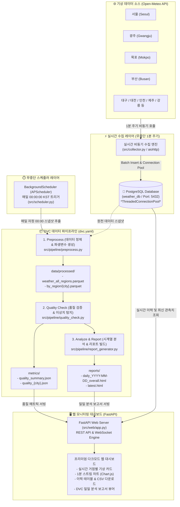
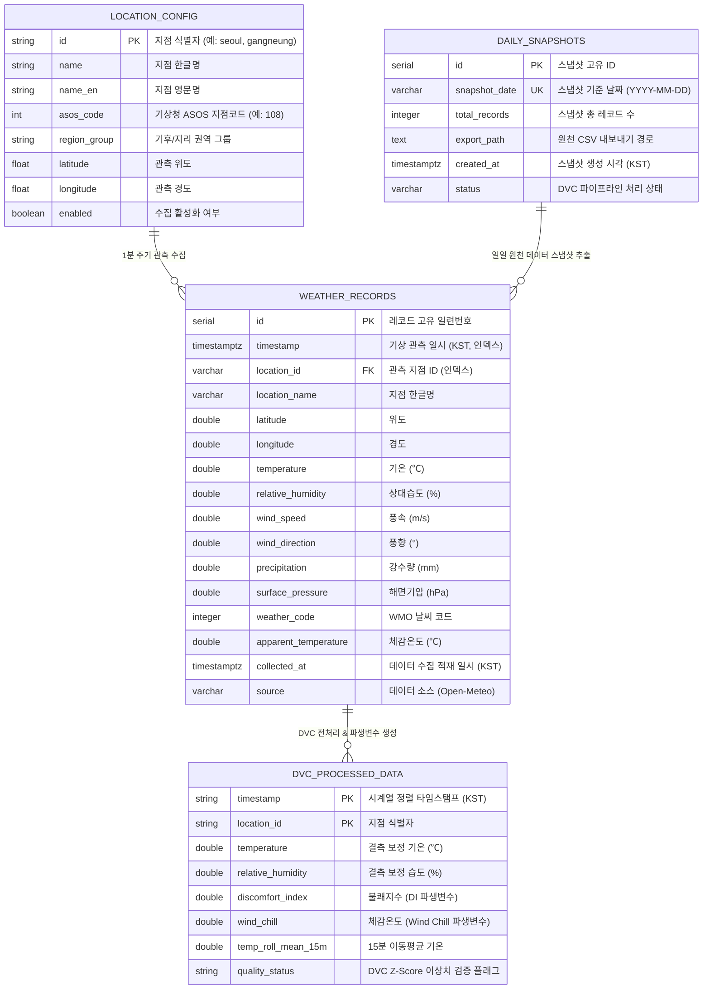

# 🌦️ WeatherMLOps: 실시간 날씨 데이터 수집 파이프라인 & DVC 버전 관리 시스템

> **1분 간격 전국 실시간 날씨 데이터 수집**, **PostgreSQL 기반 고성능 데이터 저장소 및 커넥션 풀링**, **DVC(Data Version Control) 기반 데이터 버저닝 및 품질 검증**, **매일 00:00 자정 무중단 일일 분석 보고서 자동화**, 그리고 **통합 모니터링 웹 대시보드**를 제공하는 엔터프라이즈급 MLOps 데이터 파이프라인 프로젝트입니다.

---

## 🏗️ 시스템 아키텍처 (System Architecture)



---

## 🗄️ 데이터베이스 ER 다이어그램 (Entity-Relationship Diagram)



---

## 🌟 주요 기능 (Key Features)

### 1. 전국 다중 거점 1분 실시간 비동기 수집 & PostgreSQL 저장
- **대상 지역**: 서울, 광주, 목포, 부산, 대구, 대전, 인천, 제주, 강릉 등 전국 주요 거점
- **수집 주기**: 1분 (60초) 비동기 병렬 호출 (`aiohttp`)
- **데이터베이스**: **PostgreSQL 16** (스레드 세이프 커넥션 풀링 `psycopg2.pool.ThreadedConnectionPool`, 인덱싱 및 원자적 트랜잭션 적용)
- **수집 항목**: 기온(℃), 상대습도(%), 풍속(m/s), 풍향(°), 해면기압(hPa), 강수량(mm), 체감온도(℃), 날씨코드

### 2. DVC (Data Version Control) 파이프라인
- **`preprocess`**: PostgreSQL에서 당일 데이터 스냅샷을 추출하여 결측치 보정, 불쾌지수(DI), 체감온도(Wind Chill), 15분 이동평균 생성 후 전국 통합 및 지역별 Parquet/CSV 저장
- **`quality_check`**: 1,440분 기준 결측률 검사, Z-Score 이상치 탐지, 기상 물리적 범위 위반 검사 후 `metrics/quality_summary.json` 지표 산출
- **`analyze_report`**: 시계열 추이, 지역별 Boxplot, 상관분석 히트맵을 생성하여 인터랙티브 HTML 일일 보고서 빌드
- `dvc repro` 및 `dvc metrics show` 명령을 통해 데이터 파이프라인 재현 및 품질 추적

### 3. 매일 00:00 자정 무중단 자동화 스케줄러
- `APScheduler` 기반으로 매일 자정 00:00:00(KST)에 실시간 수집을 중단하지 않고 전일 24시간치 스냅샷을 기반으로 DVC 파이프라인을 자동 구동

### 4. 통합 모니터링 웹 대시보드 (FastAPI)
- **실시간 날씨 현황 카드**: 서울, 광주, 목포 등 탭 클릭 시 해당 지역 기상 정보 즉시 표시
- **1분 실시간 스트림 차트**: Chart.js 기반 기온/습도 실시간 그래프
- **수집 이력 조회 & 검색**: 지역별/일시별 필터링 및 **CSV 원클릭 다운로드** 지원
- **DVC 보고서 뷰어**: 자정마다 자동 생성된 분석 보고서를 웹 상에서 모달 미리보기 및 새 창으로 열람 가능
- **수동 제어**: 상단 버튼으로 '즉시 수집' 및 'DVC 파이프라인 즉시 실행' 지원

---

## 📁 프로젝트 디렉터리 구조

```text
WeatherMLOps/
├── .dvc/                       # DVC 설정 및 메타데이터
├── data/
│   ├── raw/                    # PostgreSQL 추출 원천 데이터 일일 스냅샷 (DVC 추적)
│   └── processed/              # 정제된 Parquet/CSV 데이터 (전국 및 지역별)
│       └── by_region/          # 지역별 Parquet 파일 (seoul.parquet, gwangju.parquet 등)
├── metrics/                    # DVC 품질 메트릭 (quality_summary.json 등)
├── reports/                    # 자동 생성된 일일 분석 보고서 HTML
├── src/
│   ├── config.py               # 설정 로더
│   ├── db.py                   # PostgreSQL 커넥션 풀링 및 쿼리 모듈
│   ├── collector.py            # 1분 실시간 비동기 다중 거점 수집기
│   ├── scheduler.py            # 00:00 자정 무중단 스케줄러
│   ├── seed_data.py            # 24시간 모의/초기 데이터 시드 생성기
│   ├── pipeline/
│   │   ├── preprocess.py       # 전처리 및 파생변수 생성
│   │   ├── quality_check.py    # 데이터 품질 검증 및 이상치 탐지
│   │   └── report_generator.py # 인터랙티브 HTML 분석 보고서 빌더
│   └── web/
│       ├── app.py              # FastAPI 서버 & REST API
│       ├── static/             # CSS & JavaScript (Chart.js 연동)
│       └── templates/          # 대시보드 Jinja2 HTML 템플릿
├── config.yaml                 # PostgreSQL 연결 정보, 지역 좌표, 수집 주기 설정
├── docker-compose.yml          # PostgreSQL 컨테이너 구성 파일
├── dvc.yaml                    # DVC 파이프라인 스테이지 정의
├── requirements.txt            # 의존성 패키지 목록
└── README.md                   # 프로젝트 문서
```

---

## 🚀 빠른 시작 가이드 (Quick Start)

### 1. PostgreSQL 컨테이너 실행
```bash
docker compose up -d
```

### 2. 가상환경 구성 및 패키지 설치
```bash
# 가상환경 생성
python -m venv .venv

# 가상환경 활성화 (Windows PowerShell)
.venv\Scripts\Activate.ps1

# 의존성 설치
pip install -r requirements.txt
```

### 3. DVC 초기화
```bash
git init
dvc init
```

### 4. 초기 시드 데이터 생성 (선택 사항)
```bash
python -m src.seed_data
```

### 5. 웹 대시보드 및 백그라운드 수집기 실행
```bash
python -m uvicorn src.web.app:app --host 0.0.0.0 --port 8000
```
- 브라우저에서 **`http://localhost:8000`** 으로 접속합니다.
- 서버 실행 시 **1분 주기 실시간 수집기**와 **자정 00:00 스케줄러**가 자동으로 함께 시작됩니다.

---

## 📊 DVC 명령어 가이드

```bash
# 1. DVC 파이프라인 전체 스테이지 실행 (전처리 -> 품질검증 -> 리포트 생성)
dvc repro

# 2. 데이터 품질 메트릭 확인
dvc metrics show

# 3. 특정 스테이지 파이프라인 상태 점검
dvc status
```

---

## ⚙️ 설정 파일 (`config.yaml`)

```yaml
collection:
  interval_seconds: 60  # 1분 단위 수집

storage:
  type: "postgresql"
  postgres:
    host: "127.0.0.1"
    port: 5432
    user: "weather_user"
    password: "weather_password"
    dbname: "weather_db"

locations:
  - id: "seoul"
    name: "서울"
    latitude: 37.5665
    longitude: 126.9780
    enabled: true
  - id: "gwangju"
    name: "광주"
    latitude: 35.1595
    longitude: 126.8526
    enabled: true
  - id: "mokpo"
    name: "목포"
    latitude: 34.8118
    longitude: 126.3922
    enabled: true

quality_thresholds:
  expected_records_per_day: 1440
  min_completeness_ratio: 0.95
  z_score_threshold: 3.5

scheduler:
  daily_report_cron: "0 0 * * *" # 매일 00:00:00 (자정)
```
